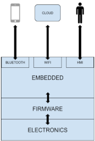

# Answers for Part 2: System Testing

## Given below architecture:

### a) How would you test that the API between the embedded and the cloud is working as expected without having the real physical device

Assuming the embedded device would be normally communicating with the cloud through HTTPS and/or MQTTS, we can create:

- test user (username & password) and/or
- test certificates (similar to what an embedded device ideally would have)

and create keywords/functions that would be mocking the embedded device's real communication.
We can use the created credentials and/or certificates to authenticate the HTTPS and/or MQTTS requests/messages sent to the cloud mocking the embedded device.

We can then verify:

- (with the help of other or the same credentials/certificates) that certain resources (e.g. lambdas) have been accessed/triggered in the cloud

Alternatively we could set up e.g. a Dockerized environment including some (or all) of the components that are originally running in the embedded device's software as well as certificates used to access cloud resources.
This way we could send HTTPS/MQTTS requests/messages directly to this Dockerized environment's http(s) server and/or mosquitto broker, and verify:
- certain MQTT messages are triggered and/or
- certain cloud resources have been accessed (if the Dockerized environment has internet connectivity) and/or
- certain files have been created/modified

### b) How would you test that the API between the embedded and the mobile is working as expected without having the real physical device

Assuming the mobile app originally communicating via Bluetooth with the embedded device supports "test mode" as in reading data from and writing data to a given file, we could mock all the communication that would be happening between the two:

- Test that for given input (originally received from the embedded device, but read from a file), certain output is produced (result is written to a file)

But since there would be 2 parties interfacing each other (mobile & embedded device) we should also set up an environment for the embedded device software's Bluetooth module and configure it to also run in "test mode". This way we can test the other half of the communication:

- Test that for given input (originally received from the mobile app, but read from a file), certain output is produced (result is written to a file)
- If the environment is complex enough, we could further test:
    - the device's communication with the cloud,
    - file-system changes
